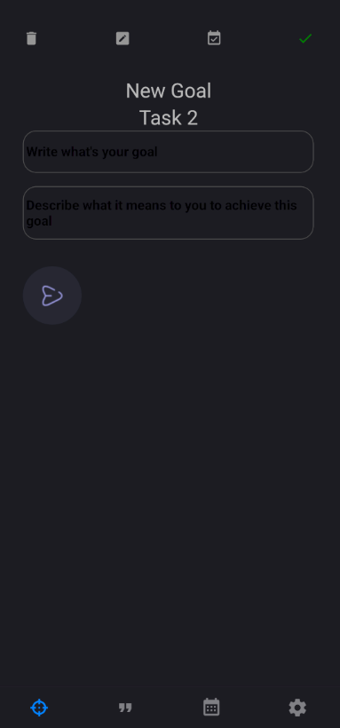
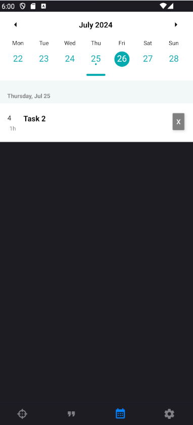

# Planimate

Planimate is a React Native application designed to help users plan their goals and break them down into smaller, manageable tasks. The app features a goal planner, a quote section for daily inspiration, and a calendar view for easy scheduling. Future plans include expanding the app with social features and AI assistance.

## Features

- **Goal Planning:** Create and manage goals, breaking them down into smaller tasks.
- **Quote Section:** Get daily inspirational quotes to stay motivated.
- **Calendar:** Schedule and view tasks and goals on a calendar.
- **Offline:** Supports both offline usage and saving/loading data


## To-do's:
- **Functionality:** Implementing remaining functionality listed in "Our vision"
- **Styling:** The app needs better styling.
- **Atomization:** App components will have to be divided into smaller parts.
- **Future Plans:** Expand the app with social features and AI assistance.

## Screenshots
| Quotes                                            | Tasks                                           | Calendar                                                |
|---------------------------------------------------|-------------------------------------------------|---------------------------------------------------------|
 |  |  |  |

## Prerequisites

- **Node.js**: Version 18 or higher
- **Yarn**: Version 3.6.4
- **Android Studio**: For running the app on Android
- **Environment**: Use this link as reference for setting it up https://reactnative.dev/docs/set-up-your-environment
## Installation

1. **Clone the repository:**
   ```sh
   git clone https://github.com/wfarat/Planimate.git
   cd planimate
   ```

2. **Install dependencies:**
   ```sh
   yarn install
   ```

## Running the App

### On Android

1. **Start the Metro bundler:**
   ```sh
   yarn start
   ```

2. **Run the app on an Android device/emulator:**
   ```sh
   yarn android
   ```

### On iOS (Optional)

If you plan to run the app on iOS, ensure you have Xcode installed.

1. **Install CocoaPods dependencies:**
   ```sh
   cd ios
   pod install
   cd ..
   ```

2. **Run the app on an iOS device/emulator:**
   ```sh
   yarn ios
   ```

## Testing

Run the test suite using Jest:
```sh
yarn test
```

Generate a test coverage report:
```sh
yarn test:report
```

## Our vision

### Major Use Cases
1. **Goal Management**: Users can create, edit, and delete their personal, unique goals. They can view their goals in a clear and organized manner.
2. **Task Management**: Under each goal, users can create, edit, and delete tasks. Hierarchical organization in the form of parent tasks (e.g., research, development, testing) and subtasks (e.g., data collection, testing phase 1) allows clear tracking of work.
3. **Time Estimation and Logging:** Users assign expected completion times to tasks/subtasks. They can log actual time spent, allowing comparison between estimated and actual time. This fosters realistic future planning.
4. **Progress Tracking**: Progress bars show completion status of tasks and goals, providing a quick visual representation of the user's progress.
5. **Task Dependencies**: Users set dependencies between tasks. This enforces a logical order of task completion, especially important for complex projects.
6. **Prioritization**: Users have the ability to prioritize tasks. This helps them focus their efforts on pressing or high-value tasks first.
7. **Reminders and Notifications**: The app sends prompts and alerts for task deadlines and changes in task status. This ensures users are always aware of their current task demands.
8. **Collaboration**: The app facilitates shared goals and tasks, enabling teamwork. Users can leave comments and notes on tasks enhancing communication between team members.
### Additional Features
In addition to these primary use cases, the app might also include features for:
1. **Flexible Views**: Users can switch between different task view modes. For example, a list view for simple task lists, a calendar view for understanding task deadlines in the context of their calendar, or even a Gantt chart view for understanding task dependencies and project timelines.
2. **Daily Motivation**: A "Quote of the day" feature provides users with daily motivation, promoting a positive mindset and productive environment.
### Sustainable Innovation
Future version releases might involve developments such as introducing AI for:
1. **Automatic Prioritization**: Using machine learning, the app could learn a user's behavior and automatically prioritize future tasks based on their habits.
2. **Smart Time Estimation**: Based on past tasks and their actual completion times, the app could provide users with more accurate time estimates for future tasks.
By executing these use cases, your app will provide immense value to users, supporting them in achieving their goals through effective planning and time management.
## Contributing
Contributions are welcome! Please fork the repository and submit a pull request.

1. **Fork the repository**
2. **Create a new branch (`git checkout -b feature-branch`)**
3. **Commit your changes (`git commit -am 'Add new feature'`)**
4. **Push to the branch (`git push origin feature-branch`)**
5. **Create a new pull request**

## License

This project is licensed under the MIT License.

## Contact

For any questions or feedback, please contact [wfarat@gmail.com](mailto:wfarat@gmail.com).

---
